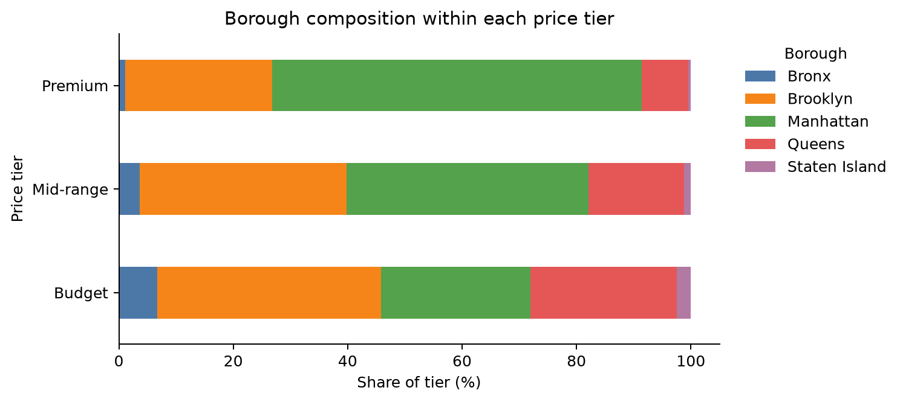
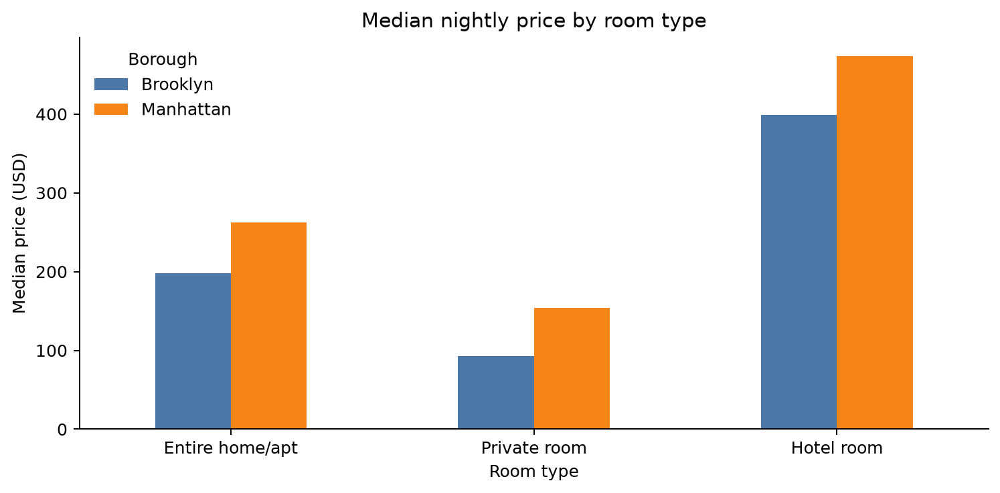
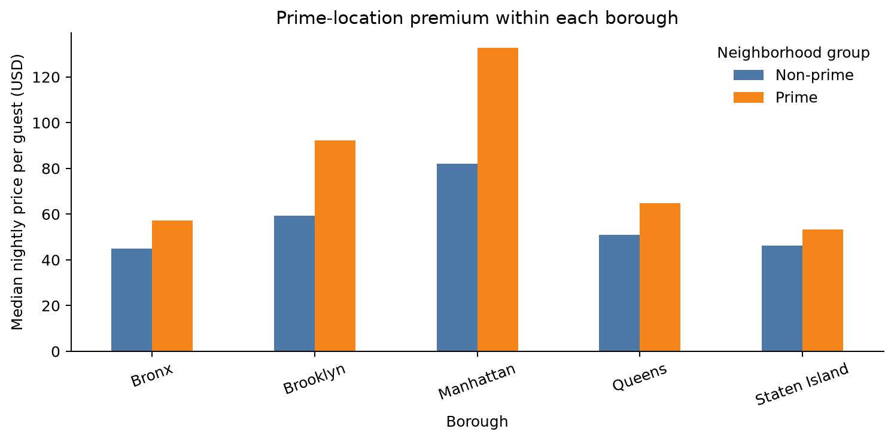

# NYC Airbnb Listings
## Data Preparation and Part II Analysis Reference

**Dataset:** `listings.csv`  
**Snapshot:** New York City, June 2026  
**Scope:** Data inspection, cleaning decisions, methods, results, and limitations

---

## Executive summary

This report records the complete Airbnb listings workflow used for Part II of
the assignment. The source contains 30,259 listings and 16,474 hosts. A usable
nightly price is available for 21,515 listings, or 71.1% of the data.

The clearest result is that location and listing type matter most for price.
Manhattan remains more expensive than Brooklyn within the same room types, and
prime neighborhoods charge more per guest in every borough. Queens offers a
convincing balance of capacity and price for larger groups. Gyms and pools are
linked to higher prices, although part of that difference comes from borough
and room type. Large host portfolios contain more Premium listings but do not
show a clear amenity advantage.

| Main result | Evidence |
|---|---|
| Premium supply is concentrated in Manhattan | Manhattan contains 64.6% of the Premium tier |
| Manhattan remains more expensive than Brooklyn | Entire homes: $262 vs $198; private rooms: $154 vs $92 |
| Prime neighborhoods cost more per guest | The within-room-type gap ranges from 16% to 79% |
| Queens gives reliable value for larger groups | 424 large entire homes; median 2.89 guests per $100 |
| Large portfolios hold higher-priced inventory | The 21+ group has a $220 median and 42.6% Premium share |

---

## 1. Dataset and scope

One row in `listings.csv` represents one advertised Airbnb listing. It does
not represent a booking, guest, or completed stay. The scrape dates range from
14 to 23 June 2026.

| Data check | Result |
|---|---:|
| Raw rows | 30,259 |
| Raw columns | 90 |
| Unique listing IDs | 30,259 |
| Unique hosts | 16,474 |
| Listings with price | 21,515 (71.1%) |
| Listings without price | 8,744 (28.9%) |
| Median available price | $174.69 |
| Average available price | $278.23 |
| Median listed amenities | 28 |
| Listings requiring at least 30 nights | about 82% |

Manhattan and Brooklyn together contain about 80% of the listings. City-wide
results therefore mainly reflect these two boroughs, while estimates for the
Bronx and Staten Island are based on smaller groups.

### Price coverage

Missing prices are not evenly distributed across the data.

| Scrape source | Listings | Price coverage |
|---|---:|---:|
| City scrape | 21,461 | 95.0% |
| Previous scrape | 8,798 | 12.8% |

Because price availability depends strongly on scrape source, missing prices
were not filled in. Price questions use the 21,515 priced listings. Room type,
capacity, amenities, and host structure use all listings whenever price is not
required.

---

## 2. Preparation workflow

```text
listings.csv
    │
    ├── scripts/extract.py
    │     └── artifacts/extract_report.txt
    │
    ├── scripts/cleanup.py
    │     ├── artifacts/listings_eda.csv
    │     └── artifacts/cleanup_log.txt
    │
    ├── notebooks/listings_data_inspection.ipynb
    │
    └── notebooks/part_ii_analysis.ipynb
          └── seven assignment analyses
```

### 2.1 Raw-data inspection

`scripts/extract.py` reads the full source without modifying it. It checks identifiers,
data types, missing values, empty columns, price coverage, room types, host
fields, reviews, and amenities.

The inspection found several completely empty fields, including `host_since`,
host response fields, `instant_bookable`, `calendar_updated`, and some raw
neighborhood fields. Numeric bathrooms are 33.4% missing, while
`bathrooms_text` is only 0.5% missing. Estimated revenue is missing whenever
price is missing, and both revenue and occupancy are estimates rather than
observed transactions.

### 2.2 Cleaning decisions

`scripts/cleanup.py` creates a 54-column analysis view and keeps all 30,259 rows. The
main rule was to make values usable without hiding the condition of the source
data.

| Step | Decision | Reason |
|---|---|---|
| Prices | Parse currency strings into `price_usd` | Allows numeric comparisons |
| Dates | Convert review and quote dates to datetime | Supports listing-age analysis |
| Booleans | Keep True, False, and missing separately | Avoids treating missing as False |
| Amenities | Parse JSON lists and count items | Supports feature analysis |
| Missing values | Leave missing | Avoids inventing information |
| Extreme prices | Flag but retain | Keeps unusual records visible |
| Empty columns | Exclude from the analysis view | They contain no information |
| Rows | Keep every row | Preserves the original listing population |

Useful flags include `has_price`, `has_reviews`, `is_previous_scrape`,
`is_long_stay_only`, `is_multi_listing_host`, and `flag_price_extreme`.
There are 202 extreme-price flags, 1,163 rows with quote dates but no price,
and no listings outside the broad NYC coordinate limits.

### 2.3 Code quality

The preprocessing uses pandas operations such as `groupby`, `agg`,
`crosstab`, `qcut`, `cut`, `merge`, `explode`, and `str.contains`. There are no
manual loops over the 30,259 listing rows. Small loops are used only over a
fixed set of five amenities or plotting labels.

---

## 3. Analysis definitions

| Measure | Definition |
|---|---|
| Budget | Price up to $121.18 |
| Mid-range | Price above $121.18 and up to $247.47 |
| Premium | Price above $247.47 |
| Prime neighborhood | Neighborhood median is in the top quarter of its borough |
| Price per guest | Nightly price divided by `accommodates` |
| Value score | Guests accommodated per $100 |
| No availability | 0 available days in the next 30 days |
| Limited availability | 1–14 available days |
| Readily available | 15–30 available days |
| Listing age | Time from first review to that listing's scrape date |
| Host portfolio | 1, 2–5, 6–20, or 21+ calculated host listings |

Median prices are reported more often than averages because a small number of
very expensive listings pull the average upward.

---

## 4. Results

### 4.1 Price segmentation and market overview

The three tiers contain almost equal numbers of priced listings by design.

| Tier | Listings | Median price | Median capacity | Median amenities | Typical segment |
|---|---:|---:|---:|---:|---|
| Budget | 7,173 | $75.13 | 2 | 26 | Brooklyn private rooms |
| Mid-range | 7,170 | $174.69 | 2 | 32 | Manhattan entire homes |
| Premium | 7,172 | $395.93 | 4 | 35 | Manhattan entire homes |

Premium listings are larger and list more amenities. Budget listings are
spread across Brooklyn, Manhattan, and Queens, while Manhattan contains 64.6%
of the Premium tier.



*Figure 1. Borough share within each price tier. Source: 21,515 priced
listings.*

### 4.2 Manhattan and Brooklyn

Room type, property type, and capacity use all listings in the two boroughs;
price comparisons use the priced subset.

| Room type | Brooklyn median | Manhattan median | Median capacity in both |
|---|---:|---:|---:|
| Entire home | $198 | $262 | 3 guests |
| Private room | $92 | $154 | 2 guests |
| Shared room | $51 | $61 | 1 guest |
| Hotel room | $399 | $474 | 3 guests |

Entire rental units make up 59.5% of Manhattan's residential market and 37.3%
of Brooklyn's. Hotel rooms are a small segment: 2.8% of Manhattan listings and
0.4% of Brooklyn listings. Manhattan remains more expensive even after room
type is held constant.



*Figure 2. Median nightly price for comparable room types.*

### 4.3 Prime-location premium

A neighborhood is prime when its median price falls in the top quarter within
its own borough.

| Borough | Non-prime price per guest | Prime price per guest |
|---|---:|---:|
| Bronx | $44.91 | $57.25 |
| Brooklyn | $59.30 | $92.36 |
| Manhattan | $82.14 | $132.63 |
| Queens | $50.90 | $64.75 |
| Staten Island | $46.30 | $53.23 |

The premium remains when entire homes and private rooms are compared
separately. It ranges from 16% for Queens entire homes to 79% for Manhattan
private rooms. Amenity counts change little, although capacity is higher in
some prime groups. Location matters, but it is not the only difference.



*Figure 3. Median nightly price per guest inside each borough.*

### 4.4 Value for money

Value is measured as `accommodates / price × 100`, or guests accommodated per
$100. Individual rankings can be distorted by unusually low prices, so the
analysis also compares borough, room-type, and capacity groups with at least
20 listings.

Some Bronx and Staten Island groups have the highest numerical scores, but
they are small. Queens entire homes for five or more guests stand out as the
more convincing market pattern: 424 listings with a median value of 2.89
guests per $100.

### 4.5 Amenities and Superhost status

The raw comparison measures the median-price difference between listings with
and without each feature. The second comparison holds borough and room type
constant and requires at least 20 listings on each side.

| Feature | Raw price difference | Same borough and room type |
|---|---:|---:|
| Pool | 121% | 45% |
| Gym | 119% | 44% |
| Pets allowed | 68% | 26% |
| Elevator | 74% | 11% |
| Hot tub | 23% | 4% |

The smaller controlled differences show that location and listing type explain
part of the raw gap. Superhost listings cost more in Brooklyn and Queens but
less in Manhattan, so Superhost status is not a universal price premium.

### 4.6 Readiness and listing age

For listings requiring at least 30 nights, readily available homes are more
expensive than listings with no availability. Brooklyn rises from about $110
to $150, while Manhattan rises from about $171 to $266.

Short-stay listings are more expensive overall, but price does not rise
consistently with availability. Older listings are also not always more
expensive, and unreviewed listings can be costly. Zero availability may mean
booked, blocked, or unavailable; it is not observed occupancy.

### 4.7 Host portfolio effects

Structural measures use all listings. Median price and Premium share use the
priced subset.

| Portfolio | Listings | Median price | Median amenities | Premium share |
|---|---:|---:|---:|---:|
| 1 | 13,274 | $173.36 | 26 | 30.6% |
| 2–5 | 6,904 | $146.86 | 30 | 25.9% |
| 6–20 | 3,739 | $187.50 | 29 | 39.5% |
| 21+ | 6,342 | $220.00 | 29 | 42.6% |

The 21+ group contains 64.4% entire homes and 5.7% hotel rooms. The same price
pattern appears when each host is given equal weight. Price coverage varies
widely among large hosts, so their individual median prices should always be
read with the displayed coverage percentage.

---

## 5. Interpretation

The results point to three broad patterns. First, location separates prices:
Manhattan and prime neighborhoods remain more expensive after comparable room
types are considered. Second, listing format matters: entire homes, hotels,
capacity, and short-stay eligibility help explain the higher-priced market.
Third, large hosts manage more Premium inventory, but their listings do not
contain clearly longer amenity lists.

For guests, Queens offers a useful balance between capacity, price, and sample
size. For hosts, gyms and pools appear most often with higher prices, but the
smaller within-market differences show that adding one feature should not be
treated as a guaranteed price increase.

---

## 6. Limitations

This is one market snapshot rather than a time series. Listed prices are
scrape-time quotes, not completed transactions. Missing prices are strongly
linked to scrape source. Availability is not occupancy, and estimated revenue
is not confirmed income.

Amenities are host-reported and may use inconsistent names. Amenity count
measures the length of the list, not quality. Small neighborhood and borough
groups can produce unstable results. All findings describe relationships in
the data rather than causal effects.

---

## 7. Reproduction and file map

Run from the assignment directory:

```bash
python3 scripts/extract.py
python3 scripts/cleanup.py
```

Then run `notebooks/listings_data_inspection.ipynb` for the initial audit and
`notebooks/part_ii_analysis.ipynb` for the seven assignment questions.

| File | Purpose |
|---|---|
| `listings.csv` | Original Airbnb data |
| `scripts/extract.py` | Read-only raw-data audit |
| `scripts/cleanup.py` | Reusable cleaning and feature preparation |
| `notebooks/listings_data_inspection.ipynb` | Initial EDA and data-quality review |
| `notebooks/part_ii_analysis.ipynb` | Complete Part II analysis |
| `notes/PART_II_FINAL_REPORT.md` | One-page submission summary |
| `artifacts/extract_report.txt` | Raw-data audit output |
| `artifacts/listings_eda.csv` | Cleaned CSV for external inspection |
| `artifacts/cleanup_log.txt` | Cleanup checks and row counts |
| `figures/` | Figures used in this report |

The notebooks were executed from top to bottom and saved without execution
errors.
