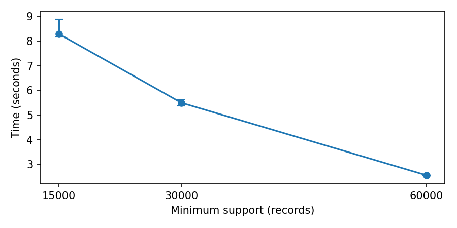
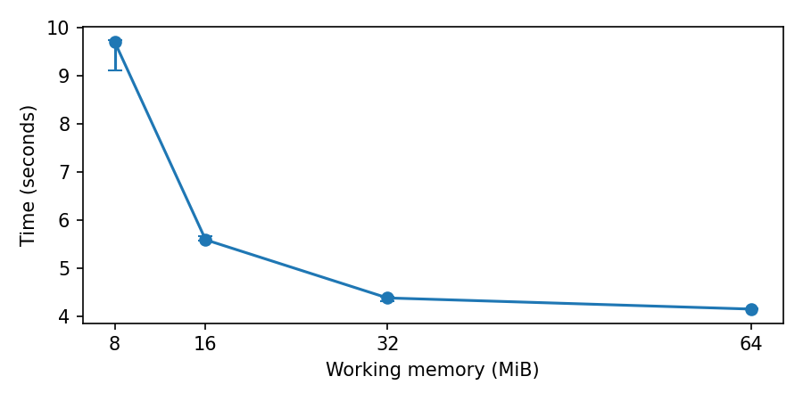
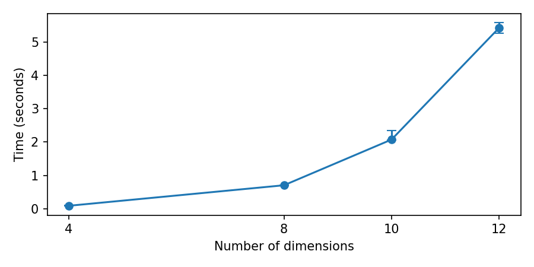
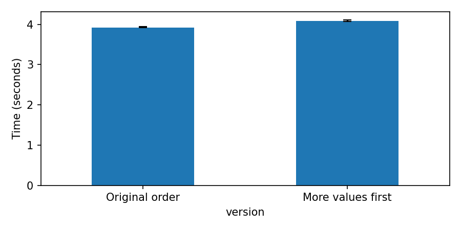

# Assignment 2 — Part 2 Report

## Dataset

The dataset contains **299,285 census records and 42 columns**. The target column is `income`.

| Income class | Records | Percentage |
| --- | ---: | ---: |
| Above $50,000 | 18,568 | 6.20% |
| At most $50,000 | 280,717 | 93.80% |

Each row is counted once. `instance_weight` is a sampling weight, so it is not used as a dimension. Missing values are labelled `Unknown`. Repeated rows are kept because two people can have the same recorded answers.

## 1. Attribute-Oriented Induction

Attribute-Oriented Induction (AOI) replaces detailed values with broader groups. This produces a smaller table that is easier to interpret.

Five concept hierarchies are stored in `hierarchies.json` rather than written directly in the code.

| Attribute | Generalization |
| --- | --- |
| Age | Exact age → 5 age ranges |
| Education | Qualification → 6 education groups |
| Industry | 52 codes → 24 major industries → 8 broad groups |
| Occupation | 47 codes → 15 major occupations → 7 broad groups |
| Worker class | 9 classes → 6 worker groups |

The supplied dataset already contains detailed and summary columns for four hierarchies. These were used to check the mappings.

| Hierarchy checked | Result |
| --- | --- |
| Industry code → major industry | Exact match for every record |
| Occupation code → major occupation | Exact match for every record |
| Household relationship → household summary | One detailed value had several summaries across 279 records |
| Previous state → previous region | `Unknown` and `Abroad` had several summaries across 1,974 records |

Ambiguous values are labelled `Ambiguous` instead of choosing a summary without evidence.

After applying the five hierarchies, limiting each attribute to 8 values gives **1,725 combinations**. This is still above the chosen limit of 500, so industry is removed by replacing it with `ALL`. The final AOI table contains **439 combinations**. The counts still add up to all 299,285 records.

### Characteristic rules

A characteristic rule shows how much of the target class belongs to a group. Its t-weight is:

```text
t-weight = high-income records in the group / all high-income records × 100
```

The largest groups for `income > $50K` are:

| Age | Education | Occupation | Worker class | High income | t-weight |
| --- | --- | --- | --- | ---: | ---: |
| 35–49 | Bachelor | Professional and managerial | Private | 1,552 | 8.36% |
| 35–49 | Postgraduate | Professional and managerial | Private | 1,400 | 7.54% |
| 35–49 | Postgraduate | Professional and managerial | Government | 673 | 3.62% |

The first rule means that **8.36% of all high-income records** belong to the first group.

### Discriminant rules

A discriminant rule shows how strongly a group is associated with the target class. Its d-weight is:

```text
d-weight = high-income records in the group / all records in the group × 100
```

Only groups with at least 100 high-income records and a d-weight above the overall 6.20% high-income rate are kept.

| Age | Education | Occupation | Worker class | High income | Low income | d-weight |
| --- | --- | --- | --- | ---: | ---: | ---: |
| 35–49 | Postgraduate | Professional and managerial | Self-employed | 531 | 352 | 60.14% |
| 50–64 | Postgraduate | Professional and managerial | Self-employed | 296 | 200 | 59.68% |

These groups have a high proportion of high-income records, but they cover a smaller part of the target class. For example, the first group has a d-weight of 60.14% but contains only 2.86% of all high-income records. T-weight measures coverage; d-weight measures the high-income share within a group.

## 2. BUC Algorithm

The cube uses 12 dimensions: survey year, sex, race, education, marital status, employment status, worker class, major industry, major occupation, tax-filer status, household summary, and previous-residence region. `income` remains the class label, and `instance_weight` is excluded.

BUC counts records for different combinations of these dimensions. `ALL` means that a dimension is unrestricted. A count is included only when it meets `minsup`, producing an iceberg cube. The main result uses `minsup = 30,000`.

### In-memory implementation

The in-memory version takes the dimension list, measure and minimum support as parameters. The measure is record count, equivalent to `COUNT(*)`.

For each group, the algorithm:

1. saves its count when it meets `minsup`;
2. splits it using the next dimension;
3. continues with each qualifying subgroup;
4. stops a branch when its count falls below `minsup`.

A subgroup cannot have a larger count than its parent, so stopping below `minsup` is safe. The cube computation uses array sorting and slicing, without a dataframe `groupby` or database engine.

### Out-of-memory implementation

The disk version also takes a memory limit. Groups that fit are processed in memory. Larger groups are split and written to temporary files, then processed one at a time. Temporary files are deleted after use.

With 12 dimensions, `minsup = 30,000`, and a 16 MiB allowance, the results are:

| Result | In memory | Out of memory |
| --- | ---: | ---: |
| Cube cells | 3,921 | 3,921 |
| Groups written to disk | 0 | 370 |

Both versions return exactly the same cube. Some example cells are:

| Combination | Count |
| --- | ---: |
| All records | 299,285 |
| Female | 155,775 |
| Male and private worker | 56,930 |
| Female and high-school graduate | 40,154 |

Cube cells overlap. For example, female high-school graduates are also included in the female total, so the cell counts should not be added together.

The result was compared with DuckDB using `GROUP BY CUBE ... HAVING COUNT(*) >= 30000`. The 12-dimensional check was divided into 16 batches to stay within DuckDB's memory limit. Together, the batches cover all 4,096 dimension subsets. Every DuckDB cell and count matched both BUC implementations. Small tests also checked empty input, repeated values, support boundaries, changed dimension order, unknown values and forced disk use.

## 3. Performance Analysis

Each setting was run three times on the full dataset. The tables report the median runtime, and the plot bars show the shortest and longest runs.

### Minimum support and runtime

Memory is fixed at 16 MiB and all 12 dimensions are used.

| Minimum support | Median runtime | Cube cells |
| ---: | ---: | ---: |
| 15,000 | 8.291 s | 9,593 |
| 30,000 | 5.498 s | 3,921 |
| 60,000 | 2.555 s | 777 |



Runtime falls as minimum support rises. More branches fail the support test early, so fewer cube cells are explored and retained.

### Memory allowance and runtime

Minimum support is fixed at 30,000 and all 12 dimensions are used.

| Memory | Median runtime | Groups written to disk |
| ---: | ---: | ---: |
| 8 MiB | 9.701 s | 1,920 |
| 16 MiB | 5.592 s | 370 |
| 32 MiB | 4.386 s | 44 |
| 64 MiB | 4.154 s | 0 |



More memory reduces temporary-file work. All four settings still return the same 3,921 cube cells.

### Number of dimensions and runtime

Minimum support is fixed at 30,000 and memory at 16 MiB.

| Dimensions | Median runtime | Cube cells |
| ---: | ---: | ---: |
| 4 | 0.089 s | 36 |
| 8 | 0.704 s | 389 |
| 10 | 2.074 s | 1,244 |
| 12 | 5.423 s | 3,921 |



Runtime grows quickly with the number of dimensions because each added dimension creates more possible combinations.

## 4. Optimization

The tested optimization processes dimensions with more distinct values first. The aim is to create small groups earlier so that more branches can be stopped by the support test.

Both versions use 12 dimensions, `minsup = 30,000`, and three timed runs.

| Version | Median runtime | Runtime range | Groups checked | Cube cells |
| --- | ---: | ---: | ---: | ---: |
| Original order | 3.924 s | 3.919–3.948 s | 28,242 | 3,921 |
| More distinct values first | 4.087 s | 4.074–4.113 s | 14,115 | 3,921 |



Reordering cuts the number of checked groups by about half, but it is slightly slower on this dataset. Runtime depends on the size of the groups being sorted as well as the number of groups. Although the output is correct, this ordering does not improve runtime for this input and support level.

## 5. BUC and AOI Comparison

AOI summarizes one target class by replacing detailed values with broader concepts. It is useful when a small number of readable descriptions is needed. Here, it reduces the data to 439 combinations and shows that the largest high-income group is aged 35–49, bachelor-qualified, professional or managerial, and privately employed.

BUC keeps the original categories and gives exact counts for many combinations. It is useful for questions such as how many records are female and high-school educated. At support 30,000, it produces 3,921 cells across 12 dimensions.

AOI results are easier to read, but they depend on the selected hierarchies and lose some detail. BUC does not generalize the categories, but its overlapping cells become harder to inspect as more dimensions are added. BUC also needs more computation; the disk version trades speed for the ability to work with limited memory.

AOI is the better choice for a short description of the high-income class. BUC is the better choice when exact counts are required for many attribute combinations.
